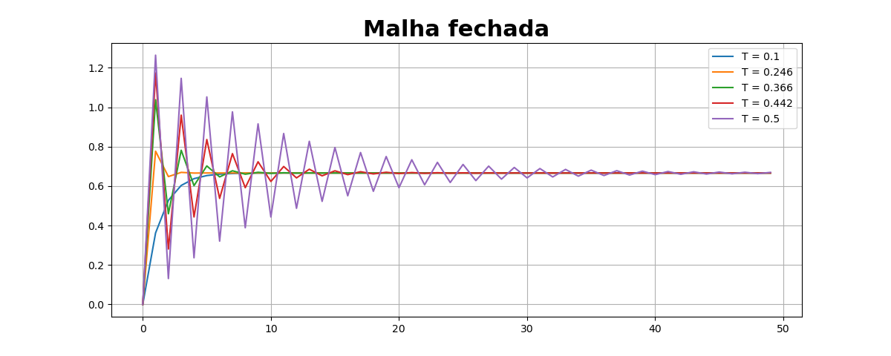

# Controle Digital

Este repositório é dedicado ao estudo e aplicação de controle digital de sistemas dinâmicos. O projeto é conduzido no Centro Federal de Educação Tecnológica de Minas Gerais (CEFET-MG).

### Sobre o Projeto

O Controle Digital é uma área da engenharia que se concentra no uso de algoritmos digitais e sistemas para controlar a operação e funcionalidade de sistemas dinâmicos. Este projeto tem como objetivo fornecer um ambiente de aprendizado e desenvolvimento para estudantes e entusiastas do controle digital. O repositório contém uma variedade de códigos Python, cada um focado em um aspecto específico do controle digital.

&nbsp;
&nbsp;

### Estrutura do Repositório

O repositório é organizado da seguinte forma:

- `utils/`: Este diretório contém ferramentas e utilitários úteis para o estudo do controle digital. Aqui você encontrará funções auxiliares e módulos que são usados em vários scripts em todo o repositório.

- `images/`: Este diretório salva os resultados obtidos nos exercícios. É aqui que todas as imagens geradas pelos scripts são armazenadas para referência futura.

- `ex01.py`, `ex02.py`, `ex03.py`, `ex04.py`: Estes são scripts Python que demonstram diferentes aspectos do controle digital. Cada script é um exercício independente que explora um conceito específico.

### Alguns resultados

    
    

    
    

    
    

    
    

### Como Contribuir

Este é um projeto de código aberto e todas as contribuições são bem-vindas. Se você deseja contribuir, por favor:

1. Faça um fork do repositório.
2. Crie uma nova branch para suas alterações.
3. Faça suas alterações ou adições.
4. Submeta suas alterações via Pull Request.

### Licença

Este projeto é licenciado sob os termos da licença [MIT](/LICENSE).

### Conceitos de Controle Digital

O controle digital é um campo vasto e complexo, mas aqui estão alguns dos conceitos fundamentais que você encontrará neste repositório:

- **Sistemas Dinâmicos**: Um sistema dinâmico é um sistema que muda ao longo do tempo. No contexto do controle digital, estamos interessados em sistemas que podem ser controlados ou manipulados de alguma forma.

- **Controle de Feedback**: O controle de feedback é uma técnica comum em controle digital onde a saída de um sistema é usada para influenciar a entrada. Isso é feito para manter a saída do sistema dentro de um intervalo desejado.

- **Estabilidade**: A estabilidade é uma propriedade importante de um sistema controlado. Um sistema é estável se, para uma determinada entrada, a saída não cresce indefinidamente.

- **Funções de Transferência**: Uma função de transferência é uma representação matemática de um sistema dinâmico. Ela relaciona a entrada do sistema à sua saída.

Estes são apenas alguns dos conceitos que você encontrará neste repositório. Cada script de exercício explora um ou mais desses conceitos em detalhes.
 